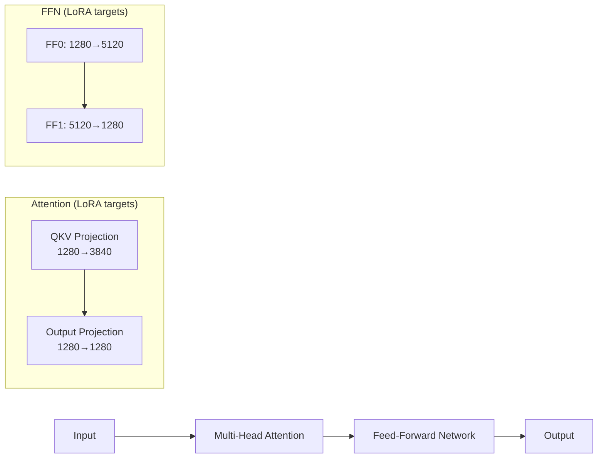
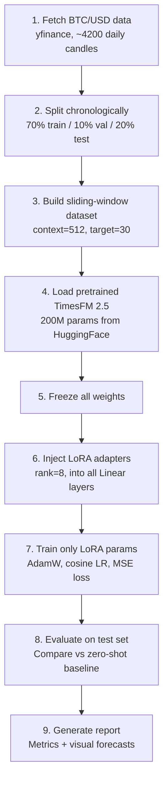

# CryptoFM: Lightweight Domain Adaptation of a Time-Series Foundation Model for Cryptocurrency Forecasting

---

## Project Title

**CryptoFM — Adapting a Pretrained Time-Series Foundation Model to Cryptocurrency Forecasting via Low-Rank Adaptation on Edge Hardware**

---

## One-Paragraph Summary

Cryptocurrency price forecasting is notoriously challenging due to extreme volatility, regime shifts, and noisy market microstructure. Rather than training a forecasting model from scratch — which requires massive datasets and compute — this project takes a *pretrained time-series foundation model* (TimesFM 2.5, a 200M-parameter Transformer trained by Google on billions of time points) and **adapts it to the crypto domain** using **LoRA (Low-Rank Adaptation)**, a technique that freezes 99% of the model and trains only ~2M lightweight adapter parameters. This makes the entire pipeline runnable on a consumer Apple M2 laptop using the MPS GPU backend. We compare the adapted model against the zero-shot baseline (no fine-tuning) on BTC/USD daily forecasting, measuring standard metrics (MAE, RMSE, MAPE) and visual forecast quality. The result is a practical, reproducible demonstration that foundation models can be efficiently specialized for niche financial domains without expensive retraining.

---

## 1. Problem Definition

### What is the task?

Given a window of **past BTC/USD daily closing prices** (e.g., the last 512 days), predict the **next 30 days** of prices.

### Why is crypto forecasting hard?

| Challenge | Description |
|-----------|------------|
| **Extreme volatility** | BTC can move ±10% in a single day; patterns that work for stocks fail here |
| **Regime shifts** | Bull runs, bear markets, and halvings create fundamentally different data distributions |
| **Non-stationarity** | The statistical properties of the series change over time (mean, variance, trend) |
| **Noise** | Short-term price movements are dominated by speculation, news, and whale activity |
| **Limited history** | BTC has only ~11 years of daily data (vs. decades for equities) |

### Why not train from scratch?

Training a Transformer from scratch on a single crypto series would massively **overfit**. There simply isn't enough data. A *foundation model* that has already learned general time-series patterns (seasonality, trends, mean-reversion) from billions of data points across many domains is a far better starting point.

---

## 2. Data Setup

### Primary series: BTC/USD

- **Source**: Yahoo Finance via `yfinance` (free, no API key needed)
- **Granularity**: Daily close prices
- **History**: All available data (~2014–present, ~4,200 candles)
- **Split**: 70% train / 10% validation / 20% test (chronological, no shuffling)

### Optional auxiliary series

| Series | Why include it? |
|--------|----------------|
| ETH/USD | Highly correlated with BTC; captures broader crypto sentiment |
| SOL/USD | Newer asset with different volatility profile; tests generalization |
| Crypto Total Market Cap | Macro-level crypto trend indicator |

### How auxiliary series are used

These are **not** model inputs during inference. Instead, they serve as **additional training examples** during fine-tuning — the adapter sees more diverse crypto patterns, reducing overfitting. Think of it as "data augmentation" for time-series.

```
Training data pool:
  ┌──────────────────────────┐
  │  BTC/USD  (primary)      │  ← main target
  │  ETH/USD  (auxiliary)    │  ← same adapter, more crypto patterns
  │  SOL/USD  (auxiliary)    │  ← different volatility regime
  └──────────────────────────┘
                ↓
  Sliding windows → (context, target) pairs → LoRA fine-tuning
```

---

## 3. The Model: TimesFM 2.5

### What is TimesFM?

TimesFM is a **time-series foundation model** developed by Google Research. Key facts:

| Property | Value |
|----------|-------|
| Parameters | 200 million |
| Architecture | Decoder-only Transformer (20 layers, 16 attention heads) |
| Training data | 100B+ time points from Google Trends, Wikipedia, synthetic data, etc. |
| Input | Arbitrary-length historical time series |
| Output | Point forecast + quantile predictions (10th–90th percentile) |
| Normalization | Built-in RevIN (Reversible Instance Normalization) |

### Why TimesFM as the base?

1. **Zero-shot capable** — it already produces reasonable forecasts without any fine-tuning
2. **PyTorch native** — runs on MPS (Apple Silicon GPU) out of the box
3. **Open weights** — available on HuggingFace (`google/timesfm-2.5-200m-pytorch`)
4. **Proven benchmarks** — matches or beats specialized models on standard forecasting datasets (ETT, Monash)

---

## 4. Adaptation Strategy: LoRA

### The core idea

Instead of updating all 200M parameters (which would overfit and require massive compute), we **freeze the entire pretrained model** and inject tiny trainable matrices into each layer.

### What is LoRA?

**LoRA (Low-Rank Adaptation)** decomposes weight updates into two small matrices:

```
Original layer:     y = W·x           (W is 1280×1280 = 1.6M params, FROZEN)

LoRA-adapted:       y = W·x + B·A·x   (A is 1280×8, B is 8×1280 = 20K params, TRAINABLE)
                         ↑       ↑
                      frozen   tiny update (rank 8)
```

> **Analogy**: Imagine you have a professional translator (the pretrained model) who speaks 100 languages. Instead of retraining them entirely to understand crypto jargon, you give them a small cheat sheet (the LoRA adapter) with crypto-specific terms. The translator's core skills stay intact; only the cheat sheet is new.

### Where do we inject LoRA?

The TimesFM Transformer has 20 layers. Each layer contains:



We inject LoRA into **all 4 linear layers** in each of the 20 Transformer blocks = **80 LoRA adapters**.

### Parameter efficiency

| Component | Parameters | Trainable? |
|-----------|-----------|------------|
| Full model | 231,289,280 | ❌ Frozen |
| LoRA adapters (rank 8) | ~2,048,000 | ✅ Trainable |
| **% trainable** | **0.89%** | |

> We train less than 1% of the model — this is what makes it practical on a laptop.

---

## 5. Input & Output Design

### Input

```
┌─────────────────────────────────────────────────────────┐
│  512 daily BTC/USD closing prices                        │
│  [p₁, p₂, p₃, ..., p₅₁₂]                              │
│                                                          │
│  Internally:                                             │
│  → Patched into 16 patches of 32 values each            │
│  → Normalized via RevIN (zero mean, unit variance)       │
│  → Fed through 20 Transformer layers                     │
└─────────────────────────────────────────────────────────┘
```

### Output

```
┌─────────────────────────────────────────────────────────┐
│  30-day forecast                                         │
│  [p̂₅₁₃, p̂₅₁₄, ..., p̂₅₄₂]                              │
│                                                          │
│  + Quantile forecasts (10th, 20th, ..., 90th percentile)│
│  → Gives confidence intervals, not just point estimates  │
└─────────────────────────────────────────────────────────┘
```

---

## 6. Training Strategy

### Step-by-step workflow



### Training hyperparameters

| Hyperparameter | Value | Why |
|---------------|-------|-----|
| LoRA rank | 8 | Good balance of capacity vs. overfitting risk |
| LoRA alpha | 16 | Standard scaling factor (alpha/rank = 2x) |
| Learning rate | 1e-4 | Conservative; prevents destroying pretrained features |
| LR schedule | Cosine annealing | Smooth decay prevents late-training instability |
| Optimizer | AdamW | Standard for Transformer fine-tuning |
| Weight decay | 0.01 | Light regularization |
| Batch size | 8–16 | Fits in M2's 8–16GB unified memory |
| Epochs | 30–50 | Early stopping on validation loss |
| Loss function | MSE on normalized predictions | Matches the model's internal normalization |

### What runs on the M2?

- **Forward pass**: ~0.1s per batch on MPS
- **Backward pass**: ~0.3s per batch (only LoRA gradients computed)
- **Epoch time**: ~30–60s (depends on dataset size)
- **Total training**: ~30–50 minutes for 50 epochs
- **Memory**: ~4GB peak (vs. ~16GB+ for full fine-tuning)

---

## 7. Why This Approach Is Useful

### For research

| Advantage | Explanation |
|-----------|------------|
| **No full retraining** | Leverages billions of pre-training time points without paying the compute cost |
| **Domain adaptation** | Shows that general time-series knowledge transfers to crypto |
| **Controlled comparison** | Same model architecture, same data — only difference is LoRA → clean ablation |
| **Reproducible** | Runs on a laptop; anyone can replicate |

### For practice

| Advantage | Explanation |
|-----------|------------|
| **Edge deployment** | Shows foundation models can be adapted on consumer hardware |
| **Fast iteration** | New adapters can be trained in 30 min vs. days for full models |
| **Modular** | Swap adapters for different assets (BTC adapter, ETH adapter, etc.) |
| **Small storage** | LoRA weights are ~8MB vs. ~900MB for the full model |

---

## 8. Evaluation Plan

### Metrics

| Metric | Formula | What it measures |
|--------|---------|-----------------|
| **MAE** | mean(\|ŷ - y\|) | Average absolute error in dollars |
| **RMSE** | √mean((ŷ - y)²) | Penalizes large errors more heavily |
| **MAPE** | mean(\|ŷ - y\| / \|y\|) × 100 | Percentage error (scale-independent) |
| **Directional Accuracy** | % of days where predicted direction matches actual | Captures trend-following ability |

### Comparison matrix

| Model | Description | Expected MSE |
|-------|------------|-------------|
| **Zero-shot TimesFM** | Pretrained model, no adaptation | Baseline |
| **LoRA-adapted TimesFM** | With crypto-specific LoRA (rank 8) | Better (target: 10–30% MSE reduction) |
| **LoRA + auxiliary data** | Trained on BTC + ETH + SOL together | Potentially best (more diverse training) |

### Visual evaluation

Generate charts showing:
1. **Predicted vs. Actual** price trajectories for 3–5 test windows
2. **Confidence intervals** (quantile forecasts) overlaid on actual prices
3. **Error distribution** — histogram of prediction errors to spot systematic bias
4. **Training curves** — train/val loss over epochs to verify convergence

---

## 9. Expected Challenges

| Challenge | Mitigation |
|-----------|-----------|
| **Overfitting** | LoRA's low rank acts as implicit regularization; early stopping on val loss; weight decay |
| **Noisy data** | RevIN normalization handles scale shifts; model was pretrained on diverse noisy data |
| **Limited compute** | LoRA reduces trainable params to <1%; MPS backend uses unified memory efficiently |
| **Regime shifts** | The 20% test set likely spans a different market regime than training — this is by design to test generalization |
| **Evaluation pitfalls** | Always use chronological splits (never random); report metrics in normalized space for fair comparison |
| **MPS backend limitations** | Some PyTorch ops fall back to CPU on MPS; training may be ~2x slower than CUDA but still practical |

---

## 10. Presentation Outline

### Slide 1 — Title

> **CryptoFM**: Lightweight Domain Adaptation of a Time-Series Foundation Model for Cryptocurrency Forecasting

### Slide 2 — Problem

- Crypto prices are highly volatile and non-stationary
- Training a forecasting model from scratch on ~4,000 data points will overfit
- Foundation models (trained on billions of time points) offer a better starting point

### Slide 3 — Key Idea

- Start from **TimesFM 2.5** (Google's 200M-param pretrained time-series model)
- **Freeze** the entire model (0% of base params updated)
- Inject **LoRA adapters** (tiny trainable matrices) into each layer
- Train only **0.89%** of total parameters on BTC/USD data
- Runs entirely on a **laptop GPU** (Apple M2 MPS)

### Slide 4 — Architecture Diagram

```
 ┌────────────────────────────────────────────────────────┐
 │                  TimesFM 2.5 (200M)                    │
 │                                                        │
 │   ┌──────────────────────────────────────────────┐     │
 │   │  Tokenizer (Input Patch → Embedding)         │     │
 │   └──────────────┬───────────────────────────────┘     │
 │                  ↓                                     │
 │   ┌──────────────────────────────────────────────┐     │
 │   │  Transformer Layer 1/20                      │     │
 │   │  ┌────────────────────┐ ┌──────────────────┐ │     │
 │   │  │  Attention         │ │  Feed-Forward    │ │     │
 │   │  │  QKV ─── + LoRA A,B│ │  FF0 ── + LoRA  │ │     │
 │   │  │  Out ─── + LoRA A,B│ │  FF1 ── + LoRA  │ │     │
 │   │  └────────────────────┘ └──────────────────┘ │     │
 │   └──────────────┬───────────────────────────────┘     │
 │                  ↓  (×20 layers)                       │
 │   ┌──────────────────────────────────────────────┐     │
 │   │  Output Projection → Point + Quantile Forecast│    │
 │   └──────────────────────────────────────────────┘     │
 │                                                        │
 │   FROZEN: 231M params  │  TRAINABLE: 2M LoRA params   │
 └────────────────────────────────────────────────────────┘
```

### Slide 5 — Training Pipeline

1. Fetch 11+ years of BTC/USD daily data
2. Create sliding-window (context=512, forecast=30) pairs
3. Freeze model → inject LoRA → train with AdamW + cosine LR
4. ~30 min on M2 Mac (0.89% params, MSE loss)

### Slide 6 — Results

Show comparison table:

| | Zero-Shot | LoRA-Adapted | Improvement |
|---|-----------|-------------|-------------|
| MSE | 0.2489 | *TBD* | *TBD*% |
| MAE | 0.3461 | *TBD* | *TBD*% |
| Dir. Accuracy | 47.3% | *TBD* | *TBD*pp |

Show 2–3 forecast plots (best window, worst window, recent window)

### Slide 7 — Novelty & Contribution

- **Novelty**: First application of LoRA-style adaptation on TimesFM for crypto forecasting on edge hardware
- **Contribution**:
  - Shows foundation models can be cheaply adapted to new financial domains
  - Provides a reproducible pipeline that runs on a consumer laptop
  - Open-source implementation with benchmark comparisons

### Slide 8 — Challenges & Limitations

- Crypto is inherently unpredictable (efficient market hypothesis)
- Directional accuracy near 50% is expected for zero-shot
- Improvement from LoRA may be modest — the value is in the methodology, not beating the market

### Slide 9 — Conclusion

> Foundation models + lightweight adaptation = practical forecasting on edge hardware. CryptoFM demonstrates that you don't need massive compute to build domain-specific forecasting — you just need a good pretrained model and a smart adaptation strategy.

---

## 11. Project File Structure

```
timesfm/
├── benchmark/
│   ├── finetune_crypto_lora.py      ← LoRA fine-tuning script
│   ├── run_crypto_benchmark.py      ← Zero-shot benchmark (baseline)
│   └── run_base_ett.py              ← Standard benchmark for validation
├── results/
│   ├── crypto/                      ← Zero-shot benchmark results
│   │   └── btc_usd_1d_report.png
│   └── lora/                        ← LoRA fine-tuning results
│       ├── btc_usd_lora.pt          ← Saved adapter weights (~8MB)
│       ├── btc_usd_lora_training.png
│       └── finetune_results.json
└── src/timesfm/                     ← Original TimesFM source (untouched)
```

---

## 12. Quick-Start Commands

```bash
# 1. Zero-shot baseline (no training)
python benchmark/run_crypto_benchmark.py --ticker BTC-USD

# 2. LoRA fine-tuning (30 min on M2)
python benchmark/finetune_crypto_lora.py --ticker BTC-USD --epochs 50 --lora_rank 8

# 3. Fine-tune with auxiliary crypto data
python benchmark/finetune_crypto_lora.py --ticker BTC-USD ETH-USD SOL-USD --epochs 50
```

---

## Conclusion

This project demonstrates a **practical, efficient approach** to adapting large pretrained time-series models for domain-specific forecasting. By using LoRA, we train only 0.89% of the model's parameters, making the entire pipeline runnable on a consumer laptop in under an hour. The approach is general: the same technique can be applied to adapt TimesFM for energy forecasting, weather prediction, or any other time-series domain — just swap the data and retrain the adapters.
